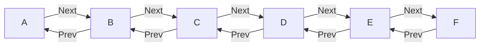

# Week 2

## Critical Sections in Concurrent Programming

In concurrent programming, managing access to shared resources is a key challenge. While locks are commonly used, a higher-level construct called a critical section, often referred to as an isolated construct, provides a more abstract and convenient approach.

### Example: Money Transfer Scenario

Consider a scenario involving a shared bank account where money transfers occur concurrently between two threads. Thread T1 deducts $100 from the parent's balance and adds $100 to the family balance. Thread T2 deducts $100 from the family balance and adds $100 to the daughter's balance.

```java
// Thread T1
{
    // critical section for T1
    family.balance += 100;
    parent.balance -= 100;
}

// Thread T2
{
    // critical section for T2
    family.balance -= 100;
    daughter.balance += 100;
}
```

In this scenario, without proper synchronization, interleaved reads and writes to the shared variable "family" can result in incorrect outcomes. For instance, if the read from T2 (R2) precedes the read from T1 (R1), and the subsequent writes (W2 and W1) occur in a specific order, the family balance might be incorrectly updated.

### Isolated Constructs

The isolated construct ensures that critical sections are executed in mutual exclusion. The specific implementation of mutual exclusion, whether through locks or other mechanisms like transactional memory, is abstracted away from the programmer. The notation isolate indicates that the two blocks of code within it cannot be interleaved.

```
// Thread T1
isolate {
    // critical section for T1
    family.balance += 100;
    parent.balance -= 100;
}

// Thread T2
isolate {
    // critical section for T2
    family.balance -= 100;
    daughter.balance += 100;
}
```

In Java, the isolate construct is not a standard language feature, and the example provided earlier is a conceptual representation. However, you can achieve similar functionality using locks or other synchronization mechanisms. Below is an example using the ReentrantLock class from the java.util.concurrent.locks package:

```java
import java.util.concurrent.locks.Lock;
import java.util.concurrent.locks.ReentrantLock;

class BankAccount {
    int balance;

    public BankAccount(int balance) {
        this.balance = balance;
    }
}

public class MoneyTransferExample {
    static Lock lock = new ReentrantLock();
    static BankAccount parent = new BankAccount(500);
    static BankAccount family = new BankAccount(1000);
    static BankAccount daughter = new BankAccount(0);

    public static void main(String[] args) {
        // Thread T1
        new Thread(() -> {
            lock.lock();
            try {
                family.balance += 100;
                parent.balance -= 100;
            } finally {
                lock.unlock();
            }
        }).start();

        // Thread T2
        new Thread(() -> {
            lock.lock();
            try {
                family.balance -= 100;
                daughter.balance += 100;
            } finally {
                lock.unlock();
            }
        }).start();
    }
}


```


## Object-Based Isolation

We have learned about critical sections and isolated as a higher-level form of synchronization. Now, we'll take a look at something called **OBJECT-BASED ISOLATION**.

### Introduction

Object-based isolation is a generalization of a concept that has been around for over five decades called **MONITORS**.

### Example: Doubly Linked List

Let's consider an example with a doubly linked list of nodes A to F, where each node has next and previous pointers.



```
// Delete operation on the doubly linked list
DELETE current {
    CUR.PREV.NEXT = CUR.NEXT;
    CUR.NEXT.PREV = CUR.PREV;
}
```
### Parallel Deletions
Suppose we have parallel delete operations on nodes B, C, and E by threads T1, T2, and T3.

* T1: DELETE B
* T2: DELETE C
* T3: DELETE E
  
We can put these delete operations in an ISOLATED construct to ensure mutual exclusion, preventing potential issues with shared variables.

### Object-Based Isolation
Object-based isolation extends isolated by listing the objects involved in the isolated region. For example:

For DELETE(B): A, B, C

For DELETE(E): D, E, F

The fundamental rule of object-based isolation states that if two isolated constructs have an empty intersection, they can proceed in parallel. Otherwise, they must be executed in mutual exclusion.

This allows deletions of B and E to happen in parallel because they have no common elements. However, implementing this capability can be very challenging with locks because a correct implementation must enforce the correct levels of mutual exclusion without entering into deadlock or livelock states.
```java
isolated(cur, cur.prev, cur.next, () -> {
    . . . // Body of object-based isolated construct
});
```
### Connection with Monitors 

A monitor is a mechanism for controlling concurrent access to an object. In Java, it is implemented using the `synchronized` keyword and is associated with every Java object.

```java
// Thread 1
public void a() {
    synchronized(someObject) {
        // do something (1)
    }
}

// Thread 2
public void b() {
    synchronized(someObject) {
        // do something else (2)
    }
}
```

This ensures that Threads 1 and 2 cannot access the synchronized section at the same time. The `synchronized` block obtains a lock on the object's monitor, preventing other threads from entering the synchronized region until the lock is released.

### Details:

- A monitor is associated with each Java object.
- The `wait()` and `notify()` (or `notifyAll()`) methods can be used for inter-thread communication using the object's monitor.
- The `synchronized` keyword is used to declare that a block of code or a method requires the lock on the object's monitor for exclusive access.
- Monitors are applied at the object level, not at the method level.
- It's crucial for managing shared resources and preventing race conditions in multithreaded environments.
```

### Concurrent Spanning Tree Algorithm

```java
void Compute(Node v) {
    for (Node c : v.neighbors) {
        async Compute(c); // Execute in parallel
    }
}

boolean MakeParent(Node v, Node c) {
    boolean success;
    Isolated(c) {
        if (c.parent == null) {
            c.parent = v;
            success = true;
        } else {
            success = false;
        }
    }
    return success;
}
```

The `isolated` construct is a higher-level synchronization primitive, and its implementation can vary based on the programming language and the underlying concurrency mechanisms available. The primary goal of `isolated` is to ensure that a block of code is executed in mutual exclusion with respect to other isolated sections involving the same shared objects. 

The code allows different threads to explore different branches of the tree in parallel. Object-based isolation ensures that when two vertices try to become the parent of the same child, it happens in mutual exclusion.

## Implementation of Object Based Isolation

We have seen that the concept of isolation and object-based isolation can be really convenient in expressing concurrent algorithms. But there is an open question as to how to implement them efficiently. Well, it turns out that there is a related concept called atomic variables.

1. **Atomic Variables:**
   - Atomic variables capture a restricted case of object-based isolation, implemented efficiently in hardware.
   - They are a specialized mechanism for handling concurrent access to shared variables.

2. **Example with Atomic Integer:**
   - Consider an array of work items accessed by multiple threads, each picking up work from the array.
   - Without proper synchronization, data races can occur in accessing the shared variable `Current`.
   - Using `atomic integers`, like `AtomicInteger`, provides a high-level and efficient solution for atomic operations.

3. **Atomic Integer Operations:**
   - The `AtomicInteger` class provides methods like `getAndAdd` for atomic operations.
   - `getAndAdd` performs an atomic read, increment, and return the previous value, ensuring thread safety.
   - It eliminates the need for manually writing low-level code to handle synchronization.

```java
import java.util.concurrent.atomic.AtomicInteger;

public class WorkProcessor {
    private static final AtomicInteger current = new AtomicInteger(0);
    private static final int N = 10; // Number of work items

    public static void main(String[] args) {
        for (int i = 0; i < 5; i++) {
            new Thread(WorkProcessor::processWork).start();
        }
    }

    public static void processWork() {
        int j;
        while (true) {
            j = current.getAndAdd(1); // Atomic increment and get
            if (j >= N) {
                break;
            }
            // Process work item X[j]
            System.out.println("Thread " + Thread.currentThread().getId() + " processed item X[" + j + "]");
        }
    }
}


```

4. **Atomic References and Compare-and-Set:**
   - Besides atomic integers, there are atomic references and operations like `compareAndSet`.
   - `compareAndSet` is a pattern where a value is set if a certain condition (comparison) holds.
   - The entire logic is executed atomically, making it a powerful and efficient construct.

```java
import java.util.concurrent.atomic.AtomicReference;

public class Example {
    private static class Node {
        int data;
        Node next;

        Node(int data) {
            this.data = data;
        }
    }

    private static final AtomicReference<Node> head = new AtomicReference<>(null);

    public static void main(String[] args) {
        // Example usage of compare-and-set pattern
        Node newNode = new Node(42);
        Node expected = head.get(); // Expected value, can be null or a specific node
        boolean success = head.compareAndSet(expected, newNode);
        if (success) {
            System.out.println("Node added successfully.");
        } else {
            System.out.println("Failed to add node.");
        }
    }
}
```

5. **Isolated Sections Matching Atomic Patterns:**
   - Object-based isolation in concurrent algorithms can be implemented efficiently using atomic variables.
   - If the isolated sections of your code match the patterns of existing atomic variables, the code executes more efficiently.
   - Examples include patterns like `getAndAdd` for atomic integers or `compareAndSet` for atomic references.

6. **Efficiency of Atomic Variables:**
   - Modern processors have special hardware support for efficient implementation of atomic patterns.
   - Using atomic variables is a step above low-level approaches like locks, providing higher-level semantics and efficiency.

7. **High-Level Semantics:**
   - Atomic variables allow programmers to think logically in terms of high-level semantics, focusing on the algorithm's intent rather than low-level synchronization details.

8. **Importance of Atomic Variables:**
   - It's crucial to be aware of and use atomic variables when applicable in concurrent programming.
   - They provide a more concise and efficient way to handle synchronization compared to traditional lock-based approaches.

Understanding and leveraging atomic variables contribute to writing concurrent algorithms that are not only correct but also efficient and scalable.

```java
public class Main {
    private final AtomicInteger counter = new AtomicInteger(0);

    // Increment the shared counter using atomic getAndAdd operation
    public void incrementCounter() {
        int oldValue, newValue;
        do {
            // Atomic read of the current value
            oldValue = counter.get();

            // Increment the value atomically using getAndAdd
            newValue = oldValue + 1;
        } while (!counter.compareAndSet(oldValue, newValue));
        // Continue looping until the update is successful (no concurrent modification)
    }

    public int getCounterValue() {
        return counter.get();
    }

    public static void main(String[] args) {
        Main example = new Main();

        // Create multiple threads to increment the counter concurrently
        Thread thread1 = new Thread(() -> {
            for (int i = 0; i < 1000; i++) {
                example.incrementCounter();
            }
        });

        Thread thread2 = new Thread(() -> {
            for (int i = 0; i < 1000; i++) {
                example.incrementCounter();
            }
        });

        thread1.start();
        thread2.start();

        try {
            thread1.join();
            thread2.join();
        } catch (InterruptedException e) {
            e.printStackTrace();
        }

        System.out.println("Final Counter Value: " + example.getCounterValue());
    }
}

```

