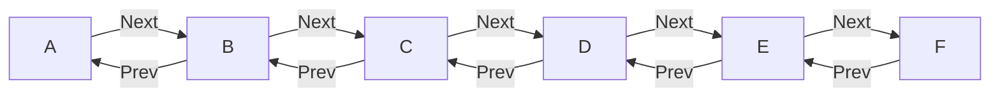

# Week 2

## Critical Sections in Concurrent Programming

In concurrent programming, managing access to shared resources is a key challenge. While locks are commonly used, a higher-level construct called a critical section, often referred to as an isolated construct, provides a more abstract and convenient approach.

### Example: Money Transfer Scenario

Consider a scenario involving a shared bank account where money transfers occur concurrently between two threads. Thread T1 deducts $100 from the parent's balance and adds $100 to the family balance. Thread T2 deducts $100 from the family balance and adds $100 to the daughter's balance.

```java
// Thread T1
isolate {
    // critical section for T1
    family.balance += 100;
    parent.balance -= 100;
}

// Thread T2
isolate {
    // critical section for T2
    family.balance -= 100;
    daughter.balance += 100;
}
```

In this scenario, without proper synchronization, interleaved reads and writes to the shared variable "family" can result in incorrect outcomes. For instance, if the read from T2 (R2) precedes the read from T1 (R1), and the subsequent writes (W2 and W1) occur in a specific order, the family balance might be incorrectly updated.

### Isolated Constructs

The isolated construct ensures that critical sections are executed in mutual exclusion. The specific implementation of mutual exclusion, whether through locks or other mechanisms like transactional memory, is abstracted away from the programmer. The notation isolate indicates that the two blocks of code within it cannot be interleaved.

```
// Thread T1
isolate {
    // critical section for T1
    family.balance += 100;
    parent.balance -= 100;
}

// Thread T2
isolate {
    // critical section for T2
    family.balance -= 100;
    daughter.balance += 100;
}
```

In Java, the isolate construct is not a standard language feature, and the example provided earlier is a conceptual representation. However, you can achieve similar functionality using locks or other synchronization mechanisms. Below is an example using the ReentrantLock class from the java.util.concurrent.locks package:

```java
import java.util.concurrent.locks.Lock;
import java.util.concurrent.locks.ReentrantLock;

class BankAccount {
    int balance;

    public BankAccount(int balance) {
        this.balance = balance;
    }
}

public class MoneyTransferExample {
    static Lock lock = new ReentrantLock();
    static BankAccount parent = new BankAccount(500);
    static BankAccount family = new BankAccount(1000);
    static BankAccount daughter = new BankAccount(0);

    public static void main(String[] args) {
        // Thread T1
        new Thread(() -> {
            lock.lock();
            try {
                family.balance += 100;
                parent.balance -= 100;
            } finally {
                lock.unlock();
            }
        }).start();

        // Thread T2
        new Thread(() -> {
            lock.lock();
            try {
                family.balance -= 100;
                daughter.balance += 100;
            } finally {
                lock.unlock();
            }
        }).start();
    }
}


```


## Object-Based Isolation

We have learned about critical sections and isolated as a higher-level form of synchronization. Now, we'll take a look at something called **OBJECT-BASED ISOLATION**.

### Introduction

Object-based isolation is a generalization of a concept that has been around for over five decades called **MONITORS**.

### Example: Doubly Linked List

Let's consider an example with a doubly linked list of nodes A to F, where each node has next and previous pointers.



```
// Delete operation on the doubly linked list
DELETE current {
    CUR.PREV.NEXT = CUR.NEXT;
    CUR.NEXT.PREV = CUR.PREV;
}
```
### Parallel Deletions
Suppose we have parallel delete operations on nodes B, C, and E by threads T1, T2, and T3.

* T1: DELETE B
* T2: DELETE C
* T3: DELETE E
We can put these delete operations in an ISOLATED construct to ensure mutual exclusion, preventing potential issues with shared variables.

### Object-Based Isolation
Object-based isolation extends isolated by listing the objects involved in the isolated region. For example:

For DELETE(B): A, B, C

For DELETE(E): D, E, F

The fundamental rule of object-based isolation states that if two isolated constructs have an empty intersection, they can proceed in parallel. Otherwise, they must be executed in mutual exclusion.

```java
    public synchronized void deleteNode(Node node) {
        // Object-Based Isolation
        if (!isolationSet.isEmpty() && isolationSet.contains(node)) {
            // Ensure mutual exclusion for shared objects
            return;
        }

        isolationSet.add(node);

        // Perform delete operation on the node
        if (node.prev != null) {
            node.prev.next = node.next;
        } else {
            // If it's the head node, update the head
            head = node.next;
        }

        if (node.next != null) {
            node.next.prev = node.prev;
        }

        // Remove the node from the isolation set after the operation
        isolationSet.remove(node);
    }
```

This allows deletions of B and E to happen in parallel because they have no common elements.

### Connection with Monitors 

A monitor is a mechanism for controlling concurrent access to an object. In Java, it is implemented using the `synchronized` keyword and is associated with every Java object.


```markdown

### Usage Example:

```java
// Thread 1
public void a() {
    synchronized(someObject) {
        // do something (1)
    }
}

// Thread 2
public void b() {
    synchronized(someObject) {
        // do something else (2)
    }
}
```

This ensures that Threads 1 and 2 cannot access the synchronized section at the same time. The `synchronized` block obtains a lock on the object's monitor, preventing other threads from entering the synchronized region until the lock is released.

### Details:

- A monitor is associated with each Java object.
- The `wait()` and `notify()` (or `notifyAll()`) methods can be used for inter-thread communication using the object's monitor.
- The `synchronized` keyword is used to declare that a block of code or a method requires the lock on the object's monitor for exclusive access.
- Monitors are applied at the object level, not at the method level.
- It's crucial for managing shared resources and preventing race conditions in multithreaded environments.
```
